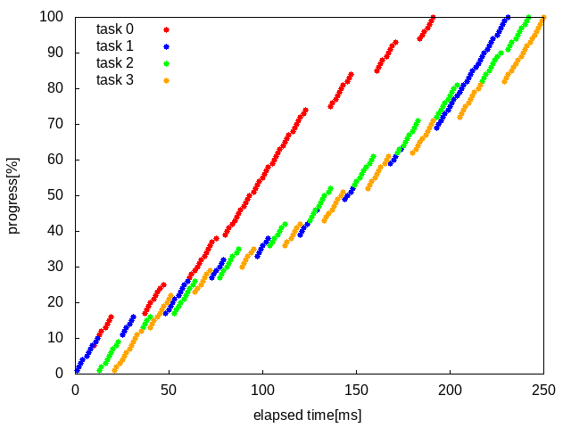
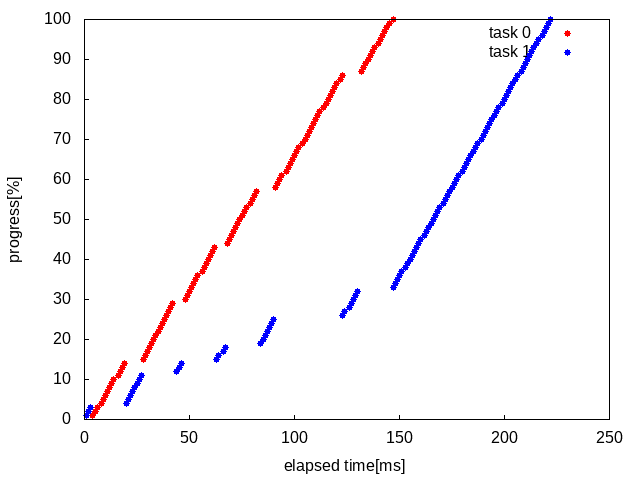

# 第4章 プロセススケジューラ

## プロセススケジューラ

Linuxは、プロセススケジューラにより複数プロセスを並行して動作させる。

- Linuxでは、マルチコアCPUの1コアが1つのCPU（論理CPU）として認識される
- 1つのCPU上で同時に実行されるプロセスは1つのみ
- 1つのCPU上で複数プロセスを実行する場合、各プロセスを適当な時間長（タイムスライス）で切り替えて順次実行する
- 1つのCPU上におけるタイムスライスは、ローテーションで切り替わり順次実行される（ラウンドロビン方式）。各タイムスライスはほぼ等しい長さの時間長となる

## コンテキストスイッチ

複数のプロセスが単一のCPUを共有できるように、CPUの状態（コンテキスト）を保存・復元する過程。

## プロセスの状態

`ps ax`で確認できるプロセスの状態には次のようなものがある。

| 状態（STATフィールド値） | 概要 |
| :- | :- |
| 実行状態 (O) | 論理CPUで実行中 |
| 実行可能状態 (R) | CPU時間の割当を待機中 |
| アイドル状態 (I) | プロセスを作成中 |
| スリープ状態 (S/D) | I/Oなどイベントの発生待ち。発生までCPU時間を使わない |
| ゾンビ状態 (Z) | プロセスが終了し、終了ステータスが読まれるのを待機中 |

プロセスは、生成されてからその終了までに実行状態/実行可能状態/スリープ状態を適宜遷移する。

### スリープ状態

- `S`: シグナルによって実行状態に戻るもの
- `D`: 上記でないもの。ストレージデバイスのアクセス待ちなど

### ゾンビ状態

通常ゾンビ状態となるのはプロセスの終了直後、プロセスの終了ステータスが検知されるまでの短い時間であるが、何らかの不具合によりこの状態が続くとメモリが開放されないままとなる（ゾンビプロセス）。

### アイドル状態

論理CPUは動作しないときアイドル状態として、特殊命令により休止状態となり消費電力を抑えている。
`sar`コマンドの`%idle`フィールドとして1秒あたりの割合を確認できる。

## スループットとレイテンシ

- スループット：単位時間あたりの総仕事量。
- レイテンシ：処理の開始から終了までの経過時間。

### 単一プロセッサでのスケジューリング

同一の長さのプロセスを1つの論理CPUで複数動作させたときの進捗率とレイテンシは次のようになる（`taskset`により動作CPUのIDを指定）。

- 1CPU1プロセス


- 1CPU2プロセス


- 1CPU4プロセス


各プロセスはタイムスライスに分割されラウンドロビン方式でスケジューリングされるため、プロセスの増加に伴ってレイテンシは悪化する。

アイドル状態がなくプロセッサの能力を使い切っているため、スループットは変わらない。

### 複数プロセッサでのスケジューリング

上記を複数のCPUで動作させたときの進捗率とレイテンシは次のようになる。

- 2CPU1プロセス


- 2CPU2プロセス


- 2CPU4プロセス



各論理CPU上でプロセスが並列して動作するため、複数プロセスの実行時には、単一プロセッサの利用時と比較してレイテンシは半分、スループットは2倍となる。

プロセス数が利用する論理CPU数より多い場合、どれかのCPU上でラウンドロビンスケジューリングが行われるためスループットは上がらない。

## 経過時間と使用時間

- 経過時間：プロセスの開始から終了までの経過時間
- 使用時間：プロセスが実際に論理CPUを使用した時間

`time`によりプロセスの経過時間と使用時間を取得できる。

- `real`: 経過時間
- `user`: ユーザーモードでのCPU使用時間
- `sys`: ユーザーランドの依頼によりシステムコールを実行していた時間

### 計測値

- 1CPU, 1プロセス

    ```
    real	0m14.463s
    user	0m14.458s
    sys	    0m0.001s
    ```

- 1CPU, 2プロセス

    ```
    real	0m26.350s
    user	0m26.338s
    sys	    0m0.004s
    ```

- 2CPU, 2プロセス

    ```
    real	0m14.473s
    user	0m26.598s
    sys	0m0.004s
    ```

各論理CPUの使用時間が計上されるため、複数の論理CPUを並列動作させるとそれに応じて使用時間は増加する。

## 優先度の変更

プロセスの実行優先度をシステムコール`nice()`で設定することができる。

- 優先度は-19 - 20、小さいほど高優先度（通常は0）
- 高優先度のプロセスに対し優先してCPU時間が割り当てられる
- 優先度を上げられるのはrootユーザ、下げるには制約なし

優先度の異なる2つのプロセス、プロセス0（nice値0）/ プロセス1（nice値5）を単一CPUで動作させた際の進捗は次のようになる。



高優先度のプロセスが優先的に実行され、先に終了する。

優先度の設定は、システムコールAPI（C言語）の呼び出しほか`nice -n`で指定できる。

`sar`の`%nice`フィールドで優先度が変更されたプロセスの実行時間割合を確認できる。
